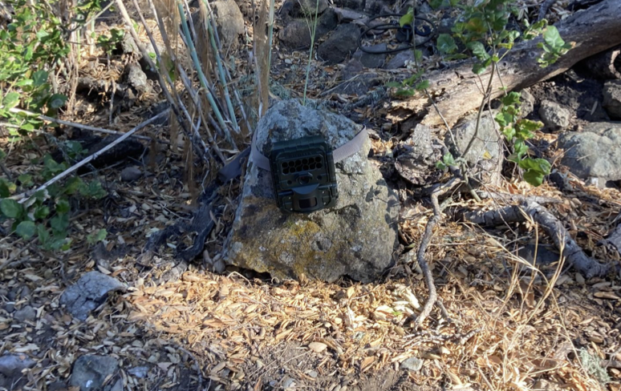

    <strong>Santa Cruz Island Spotted Skunk Project</strong>

A ML workflow for identifying spotted skunks from camera trap images taken on Santa Cruz Island in California's Channel Islands

    

On the Channel Islands there are many species of animals, some that are endemic and other that are not. One example of the an endemic species would be the island spotted skunk (Spilogale gracilis amphialus) is an insular endemic carnivore and a subspecies of the western spotted skunk (Spilogale gracilis). The skunk is only currently found on two islands off the southern coast of California (Santa Cruz Island, and Santa Rosa Island, where its occurrence is rare). Its presence has been recorded on San Miguel Island, but it has since been declared extinct in that area. The Channel Island skunk is one of two terrestrial carnivores on the islands, the other being the island fox. It is designated as a species of special concern by the state of California as its population has seen a regression in the recent years. For this reason the National Park Service, Smithsonian OCIO Data Science lab as well as the Smithsonain Scholars Program at UCSB have taken on the on going project of using machine learning & artificiall intelligence to help analyze the popluation and decide weather this species of special concern should be declared endangered or not. 

# Methods

As previously mentioned, since mid 2018 the National Park Service (NPS), Smithsonian Offie of Chief Information Officer (OCIO) Data Science Lab, and the UC, Santa Barbara Office Smithsonian Scholars have partnered together to analyze the spotted skunk poplution. On the Santa Rosa Island, we are using the Date/Time stamps on a number remote cameras which have been operating continuously from October 2018 to present to assess seasonal activity patterns of island spotted skunk and island fox. These cameras are motion activiated and are sensative to the motion of a motving branch, passing skunk or flying bird, ultamitly causing them to take thousands of pictures a day most of which are empty pictures. We however don't know which are empty and which are not so we must anylyze them one by taking up a lot of time and resources. For this reason we have decided to employ machine learning as to automate our workflow and allowing us to be quicker and automous in our work. 

    

