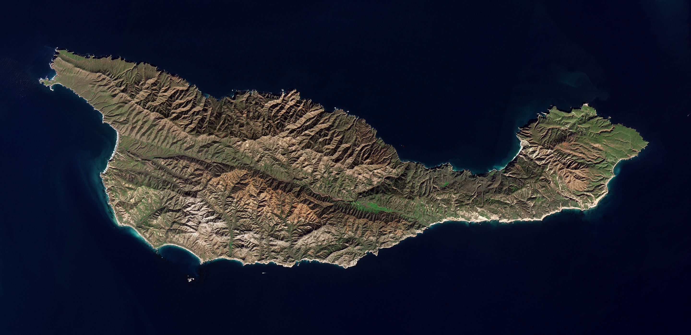

---
title: "README.md"
output: html_document
date: "2023-03-28"
---

1. Project's Title
This is the name of the project. It describes the whole project in one sentence, and helps people understand what the main goal and aim of the project is.

<p align="center">
    <strong>Santa Cruz Island Spotted Skunk Project</strong>
</p>

At the Smithsonian Office of Chief Information Officer (OCIO) Lab researchers use big data techniques, such as deep machine learning, to generate insights from their data, whether they are derived from genome sequencing, ecological sensors, or mass digitization of museum objects. These techniques require computational expertise in hardware and software to both build new algorithms and to implement the emerging tools on current and on-going project.

As mentioned new tools and algorithms are required to build process and harness and the data that is being collected and in this repository you will find a project repository tailored specifically towards an ongoing project done by the OCIO Lab at the Calfornia Channel Islands. 

# Table of Contents
1. [Purpose](#Purpose)
2. [Folders](#Folders)
3. [Third Example](#third-example)
4. [Fourth Example](#fourth-examplehttpwwwfourthexamplecom)


## Purpose
## Folders
## Third Example
## [Fourth Example](http://www.fourthexample.com)


2. Project Description
This is an important component of your project that many new developers often overlook.

Your description is an extremely important aspect of your project. A well-crafted description allows you to show off your work to other developers as well as potential employers.

The quality of a README description often differentiates a good project from a bad project. A good one takes advantage of the opportunity to explain and showcase:

What your application does,
Why you used the technologies you used,
Some of the challenges you faced and features you hope to implement in the future.


3. Table of Contents (Optional)
If your README is very long, you might want to add a table of contents to make it easy for users to navigate to different sections easily. It will make it easier for readers to move around the project with ease.


4. How to Install and Run the Project
If you are working on a project that a user needs to install or run locally in a machine like a "POS", you should include the steps required to install your project and also the required dependencies if any.

Provide a step-by-step description of how to get the development environment set and running.

5. How to Use the Project
Provide instructions and examples so users/contributors can use the project. This will make it easy for them in case they encounter a problem – they will always have a place to reference what is expected.

You can also make use of visual aids by including materials like screenshots to show examples of the running project and also the structure and design principles used in your project.

Also if your project will require authentication like passwords or usernames, this is a good section to include the credentials.

<p align="center">
    <strong>Santa Cruz Island Spotted Skunk Project</strong>
</p>

 A ML workflow for identifying spotted skunks from camera trap images taken on Santa Cruz Island in California's Channel Islands
<p align="center">
    
</p>

## Background
On the Channel Islands there are many species of animals, some that are endemic and other that are not. One example of the an endemic species would be the island spotted skunk (Spilogale gracilis amphialus) is an insular endemic carnivore and a subspecies of the western spotted skunk (Spilogale gracilis). The skunk is only currently found on two islands off the southern coast of California (Santa Cruz Island, and Santa Rosa Island, where its occurrence is rare). Its presence has been recorded on San Miguel Island, but it has since been declared extinct in that area. The Channel Island skunk is one of two terrestrial carnivores on the islands, the other being the island fox. It is designated as a species of special concern by the state of California as its population has seen a regression in the recent years. For this reason the National Park Service, Smithsonian OCIO Data Science lab as well as the Smithsonain Scholars Program at UCSB have taken on the on going project of using machine learning & artificiall intelligence to help analyze the popluation and decide weather this species of special concern should be declared endangered or not. 

## Methods

As previously mentioned, since mid 2018 the National Park Service (NPS), Smithsonian Offie of Chief Information Officer (OCIO) Data Science Lab, and the UC, Santa Barbara Office Smithsonian Scholars have partnered together to analyze the spotted skunk poplution. On the Santa Rosa Island, we are using the Date/Time stamps on a number remote cameras which have been operating continuously from October 2018 to present to assess seasonal activity patterns of island spotted skunk and island fox. These cameras are motion activiated and are sensative to the motion of a motving branch, passing skunk or flying bird, ultamitly causing them to take thousands of pictures a day most of which are empty pictures. We however don't know which are empty and which are not so we must anylyze them one by taking up a lot of time and resources. For this reason we have decided to employ machine learning as to automate our workflow 

<p align="center">
    
</p>

### Data Mining Relavent Data

Since we have partner with the NPS and the Smithonian OCIO Data Science lab we have access to more than 240,000 annoted images located on the [
Labeled Information Library of Alexandria: Biology and Conservation (LILA BC)](https://lila.science/datasets/channel-islands-camera-traps/) which follow the [COCO Data Set format](https://www.section.io/engineering-education/understanding-coco-dataset/) as well acess to 2,500 annoted images annoted using stadard practice.  


### Tidy Data 

#### Renaming and Normalizing Data

As mentioned, images from the LILA BC data set were annoted using the COCO dataset format and were normalized using best practices which can be found in the ```python_notebooks/renaming_moving.ipynb``` file as well as the ```shell_scripts/mass_move.sh```. In addition to this, we collected camera trap data. given that we are processing images from from over X_NUM cameras we are therefor receiving thousands of images everytime we go into the field. For this reason we must be  able to keep track of the images site number, camera number, expedition number, and other metadata that we must include as part of our preprocessing procedure. To do this in an fast effecient manner we created a shell script that takes in n vairables and renames the images with those n variables which the user designates. 

```
shell_scripts/mass_rename.sh
```

Once the rename naming was finsihed, I was left to reorganize the dataset into a format which [``` tflite_model_maker.image_classifier.DataLoader.from_folder() ```](https://www.tensorflow.org/lite/api_docs/python/tflite_model_maker/image_classifier/DataLoader) could read. I structured my data in a similiar way to to that of the [Flowers Data Set](https://www.kaggle.com/datasets/alxmamaev/flowers-recognition). 
```
└── Desktop
   └── Parents_directory 
           └── Class_1 
           |     ├── Class_1_img_1.jpg
           |     ├── Class_1_img_4.jpg
           |     ├── Class_1_img_2.jpg
           |     └── Class_1_img_3.jpg  
           └── Class_2 
           |     ├── Class_2_img_1.jpg
           |     ├── Class_2_img_4.jpg
           |     ├── Class_2_img_2.jpg
           |     └── Class_2_img_3.jpg  
           └── Class_3 
           |     ├── Class_3_img_1.jpg
           |     ├── Class_3_img_4.jpg
           |     ├── Class_3_img_2.jpg
           |     └── Class_3_img_3.jpg  
           └── Class_4 
                 ├── Class_4_img_1.jpg
                 ├── Class_4_img_4.jpg
                 ├── Class_4_img_2.jpg
                 └── Class_4_img_3.jpg  
```

### Model Architecture 

Since we will be running this model on edge devices, specifically the [Raspberry Pi 400](https://www.raspberrypi.com/products/raspberry-pi-400/), I choose to use the TensorFlow Lite [efficientnet_lite3 for image classification](https://tfhub.dev/tensorflow/efficientnet/lite3/classification/2) as it doesn't require as strong of a GPU as other conventional methods such as the ResNet50, YoloV5, etc. 
 
